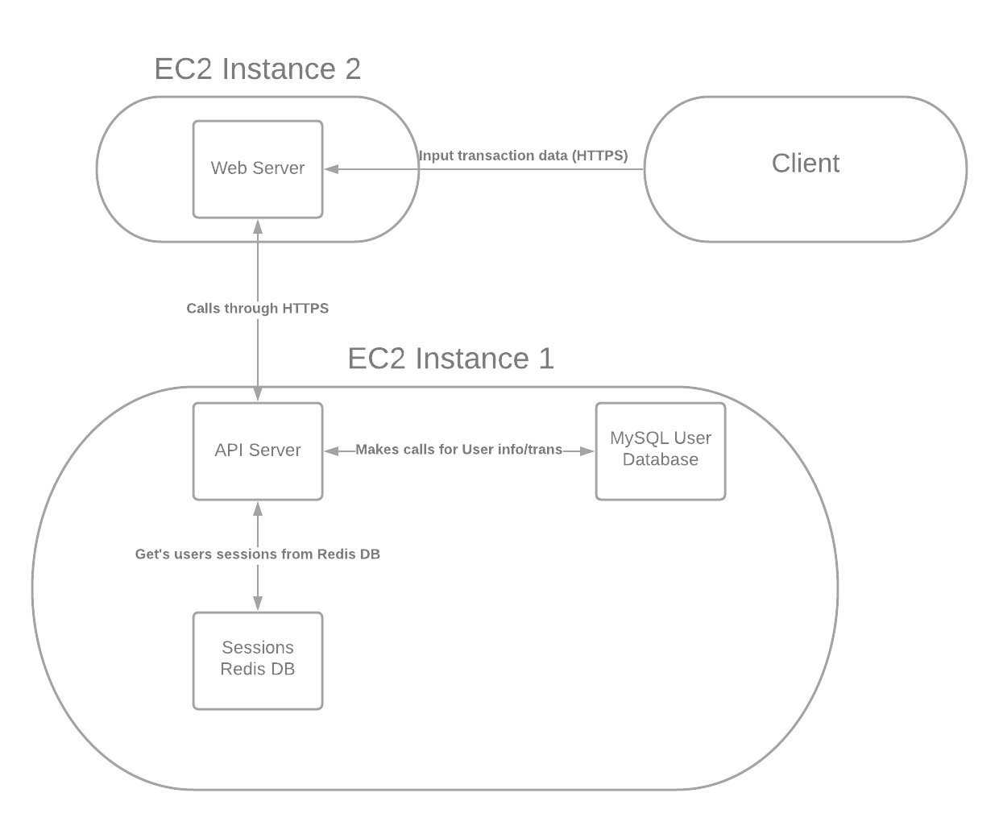

# MyBudget
## Project Description
Group Members: Colin Kwiecinski, Yash Gupta, Justin Lim, Talin Hans

### Overview
Our target audience is mainly all adults above the age of 16 and we feel that with apps like Venmo, Zelle and Splitwise money transfer has been made easy but yet we lack that user friendly app which allows us to view insightful reports from our bank statements. Moreover, we specifically target the young adults i.e college students since that is a huge user base that can be explored and most of the students want a budgeting application rather than looking through each row of the bank statement. These insightful reports would have visualizations comparing the different categories of expenses one made in the past month thereby allowing them to review if they made any miscellaneous expenses or comparing expenses over the past couple of months. We feel that this application can be as useful as Venmo or Splitwise over a period of time.

## Technical Description
### Overview
Our plan for this project is to develop a web application that allows users to input bank transaction data and generate useful reports and categorizations from that data. Users can set categorize their transactions (ie. gas, grocery, dining), and see history of spending patterns. Users will be able to create accounts to maintain their data which will all be stored in a MySQL database backend. 

### User Summary Table
| Priority | User | Description |
|---|---|---|
|P0| As a user | I want to track my spendings from a bank statement that allows me to track my budget. This will be implemented by adding a form input to input transactions. A user can specify information like amount, memo, date, and type of transaction. This information will be saved by our database. GO, SQL, HTML|
|P1|As a user | I want to tag and categorize my transactions to see where I am spending my money. This will be implemented by input forms that allow users to associate tags with certain transaction rows in the DB. Data can then be aggregated from here to generate reports. GO, JS, SQL, HTML |
|P2| As a user | I want to be able to delete all of my data quickly and easily to protect my privacy. This will be implemented by a backend function that verifies and then clears a user's bank data. GO, JS, SQL, HTML |

### Endpoints
* GET /User/{UID} - Gets the user information from the db
* POST /User - creates a new user in the db
* POST /transactions - Adding a new transaction (user’s bank statement) into the user’s transaction table. Typically contains data like: date, amount, memo, and type of transaction
* GET /transactions/{UID} - Get a specific user’s transactions
* PATCH /User/{UID} - Updating user information
* DELETE /User/{UID} - Deletes user
* DELETE /transaction/{UID} - Clear all of a user's transaction data

### Database Schemas
* Authorization
  * Aid primary key int
  * hash varchar (bcrypt implementation)
  * uid foreign key ref users int
* Users
  * Uid primary key int
  * email varchar 
  * name varchar 
  * aid foreign key auth int
* Transaction
  * TID primary key
  * UID foreign key
  * TransactionName varchar
  * Memo varchar
  * TransactionDate Date
  * Amount int
  * Type varchar

